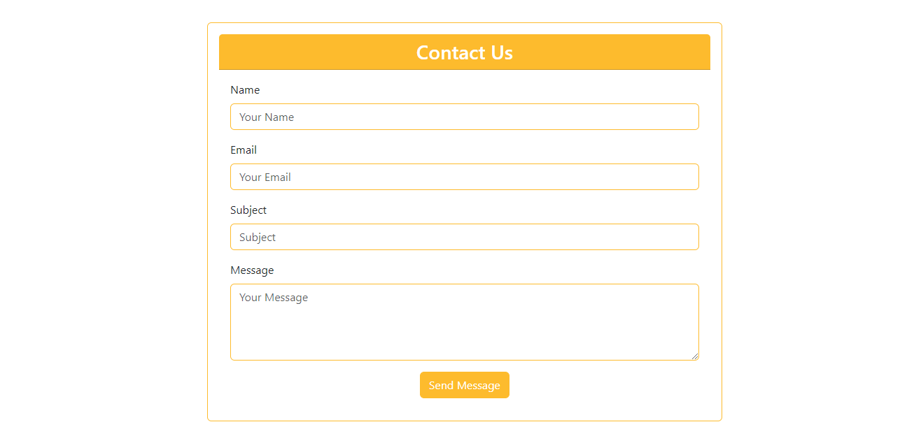
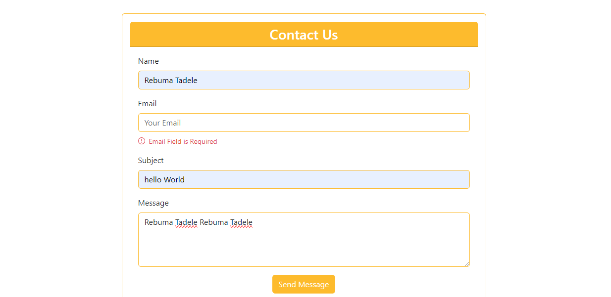

# Contact Form Component

## Overview

This repository includes a `ContactForm` component built using React. The component utilizes the `react-hook-form` library to manage form state and validation. The form includes fields for Name, Email, Subject, and Message, with validation rules to ensure required inputs and a valid email format.

## Features

- **Form Fields:**
  - **Name:** Required field.
  - **Email:** Required field with email format validation.
  - **Subject:** Required field.
  - **Message:** Required field.

- **Validation:**
  - Displays error messages for invalid or missing inputs.
  - Uses `react-hook-form` for form management and validation.

## Dependencies

- `react`
- `react-hook-form`
- `@hookform/devtools`
- `react-icons`

## Installation

**1. Clone the repository:**
   git clone <repository-url>

**2. Navigate to the project directory:**
cd <project-directory>

**Install dependencies:**
npm install

# Usage
To use the ContactForm component, import it into your React application and include it in your component tree:

# Screenshots

Description: Shows the form in a working state with valid inputs.

Description: Shows the form with error messages displayed.

Contributing
Feel free to submit issues or pull requests if you find any bugs or want to add new features.
